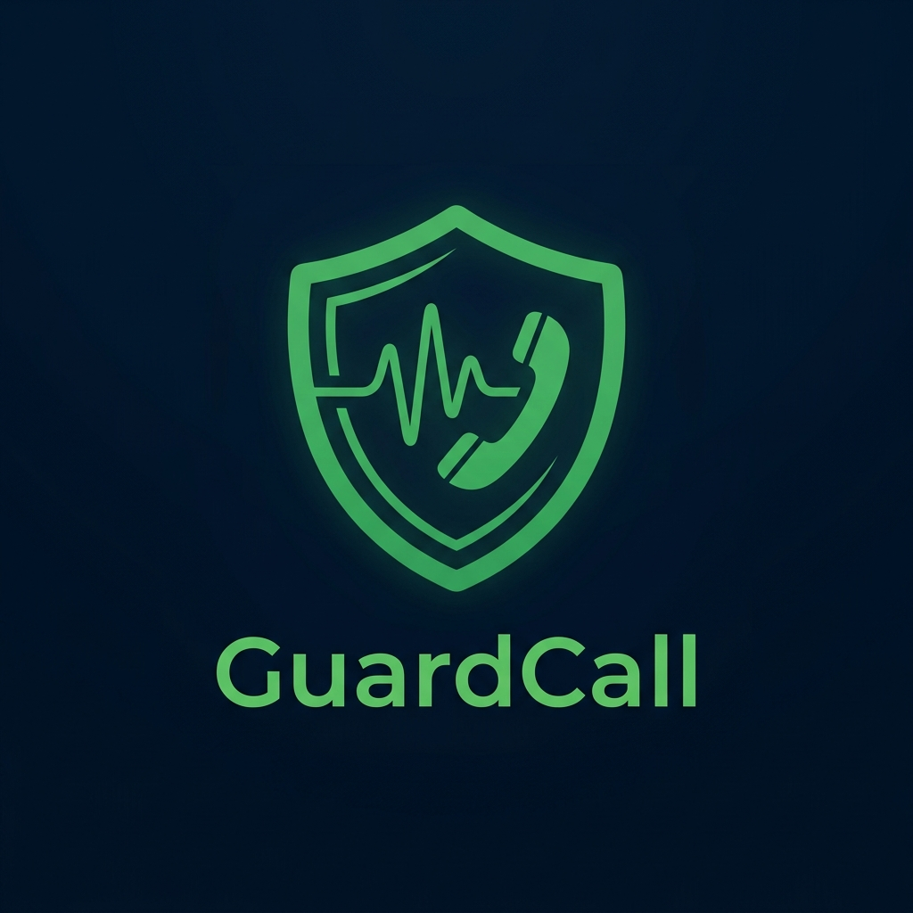

<div align="center">
  

  # 🛡️ GuardCall

  **Your Silent AI Co-Pilot for Real-Time Scam Protection**

  <p align="center">
    <a href="#what-is-guardcall">What is it?</a> •
    <a href="#how-it-works">How It Works</a> •
    <a href="#codebase-overview">Codebase Overview</a> •
    <a href="#security-privacy">Security</a> •
    <a href="#getting-started">Getting Started</a>
  </p>
</div>

---

## 🎯 What is GuardCall?

Scam calls (like "Digital Arrests") are a massive problem, costing victims millions every year. Every existing app out there (like Truecaller) only warns you *before* you pick up, or helps you report the scam *after* your money is gone. 

**GuardCall is different. It protects you *during* the call.** 

It is a web application that listens to your phone call in real-time. If it hears the scammer using manipulation tactics (like creating fake urgency or asking for money), it quietly slides a "Coaching Card" onto your screen telling you exactly what to say to expose the scammer.

## ✨ Key Features

1. **Real-Time AI Coaching**: Detects scam patterns instantly and gives you exact phrases to say to stop the scammer.
2. **Auto-Generated Police Reports**: If a call is highly suspicious, the app automatically creates a PDF incident report that you can directly submit to the police (FIR).
3. **Community Database**: Numbers are cross-checked against a crowdsourced database. If a number is reported by many users, you get warned before you even answer.
4. **Silent Protection**: No loud alarms or panic. Just quiet, helpful text cards on your screen.

---

## ⚙️ How It Works (The User Journey)

1. **Enter the Number**: You type in the caller's number. GuardCall checks if it's already a known scam number in the Community Database.
2. **Start Protection**: You put your phone on speaker. GuardCall turns on your microphone.
3. **AI Listens (Zero-Hop)**: As you speak, your browser streams the audio directly to **Deepgram's** edge servers for ultra-low latency speech-to-text.
4. **AI Analyzes (Event-Driven)**: The exact moment Deepgram flags a sentence as finished, the text triggers our AI (**Groq/Llama 3.3**) to instantly assess the threat level.
5. **Instant Coaching**: If the AI detects a scam, a warning card slides up on your screen within seconds, telling you exactly what to say to spook them.
6. **Report**: When you hang up, the AI scrubs any personal data (like your name or bank account) and saves a secure report of what happened.

---

## 🏗️ Codebase Overview

This project is a **Monorepo**, meaning it holds both the Frontend (Client) and the Backend (Server) in one place. Both parts are written in **TypeScript** for strict error-checking and reliability.

### The Technology Stack

* **Frontend (What the user sees)**:
  * **React & Vite**: The core framework used to build the user interface.
  * **Tailwind CSS**: Used for styling the app to look beautiful and modern.
  * **Zustand**: A lightweight tool to manage data across the app (like keeping track of the live transcript).
  * **Framer Motion**: Adds smooth, professional animations (like the sliding coaching cards).
  * **PWA (Progressive Web App)**: Allows the website to be installed on a phone like a native app.

* **Backend (The brain and server)**:
  * **Node.js & Express**: The server that handles requests from the frontend.
  * **Socket.IO**: Keeps a continuous, live connection open for real-time transcription updates and instant AI coaching triggers without HTTP polling overhead.
  * **MongoDB & Mongoose**: The database where we save user sessions and scam reports.
  * **Zod**: A strict "bouncer" that ensures the AI's responses are perfectly formatted before the app uses them.

* **The AI Engines**:
  * **Deepgram**: Converts the live audio into text incredibly fast.
  * **Groq (Llama 3)**: Reads the text and decides if it is a scam.

### Folder Structure

Here is a quick map of where everything lives:

```text
GuardCall/
│
├── client/                     # The Frontend Application
│   ├── src/
│   │   ├── components/         # UI pieces (CallSession, CoachingCard, ReportView)
│   │   ├── hooks/              # Custom logic (useAudioCapture, useSocket)
│   │   ├── services/           # API calls and PDF generation
│   │   └── store/              # Zustand state management (useSessionStore)
│   └── vite.config.ts          # PWA and build settings
│
├── server/                     # The Backend Application
│   ├── src/
│   │   ├── config/             # Database connection setup
│   │   ├── middleware/         # Security and Authentication checks
│   │   ├── models/             # MongoDB database schemas (User, Report)
│   │   ├── routes/             # API endpoints (e.g., /api/reports)
│   │   ├── services/           # The heavy lifters (Groq AI, Deepgram STT)
│   │   └── sockets/            # Live WebSockets logic for real-time audio
│   └── .env.example            # Template for secret API keys
│
└── docs/                       # Images for this README
```

---

## 🔒 Security & Privacy

Since we are dealing with live phone calls, privacy is our #1 priority. 

1. **Zero Raw Audio Storage**: Audio is streamed directly to the AI for transcription and then immediately deleted. Our servers **never** save the audio bytes.
2. **AI Privacy Scrubbing**: Before a transcript is saved to our database, the AI reads it and replaces any sensitive data (like "My Aadhaar is 1234") with placeholders (like `[AADHAAR]`).
3. **Conditional Storage**: If the call was perfectly safe, the transcript is wiped completely. We only save data if the risk score was high.

---

## 🚀 Getting Started

If you want to run this code on your own computer, follow these simple steps.

### Prerequisites
You will need to install **Node.js** (v18 or higher) on your computer. You will also need free API keys from:
* **Deepgram** (For Speech-to-Text)
* **Groq** (For the AI Brain)
* **MongoDB Atlas** (For the Database)

### 1. Setup the Backend
Open your terminal and type:
```bash
cd server
npm install
```
Next, rename the `.env.example` file to `.env` and paste your secret API keys inside it. Then start the server:
```bash
npm run dev
```

### 2. Setup the Frontend
Open a *new* terminal window and type:
```bash
cd client
npm install
npm run dev
```

The app will now be running at `http://localhost:5173`. Open that link in your browser, and you are ready to use GuardCall!
