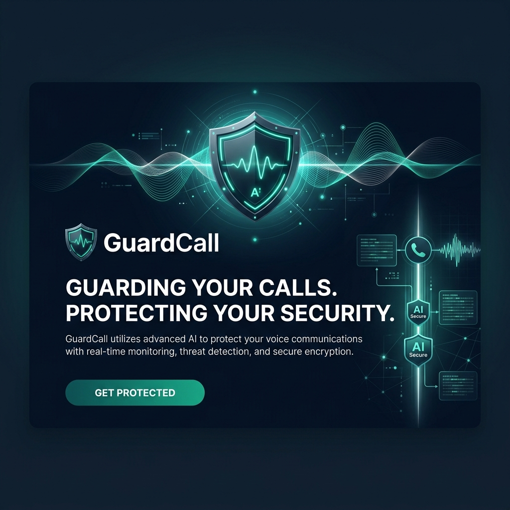
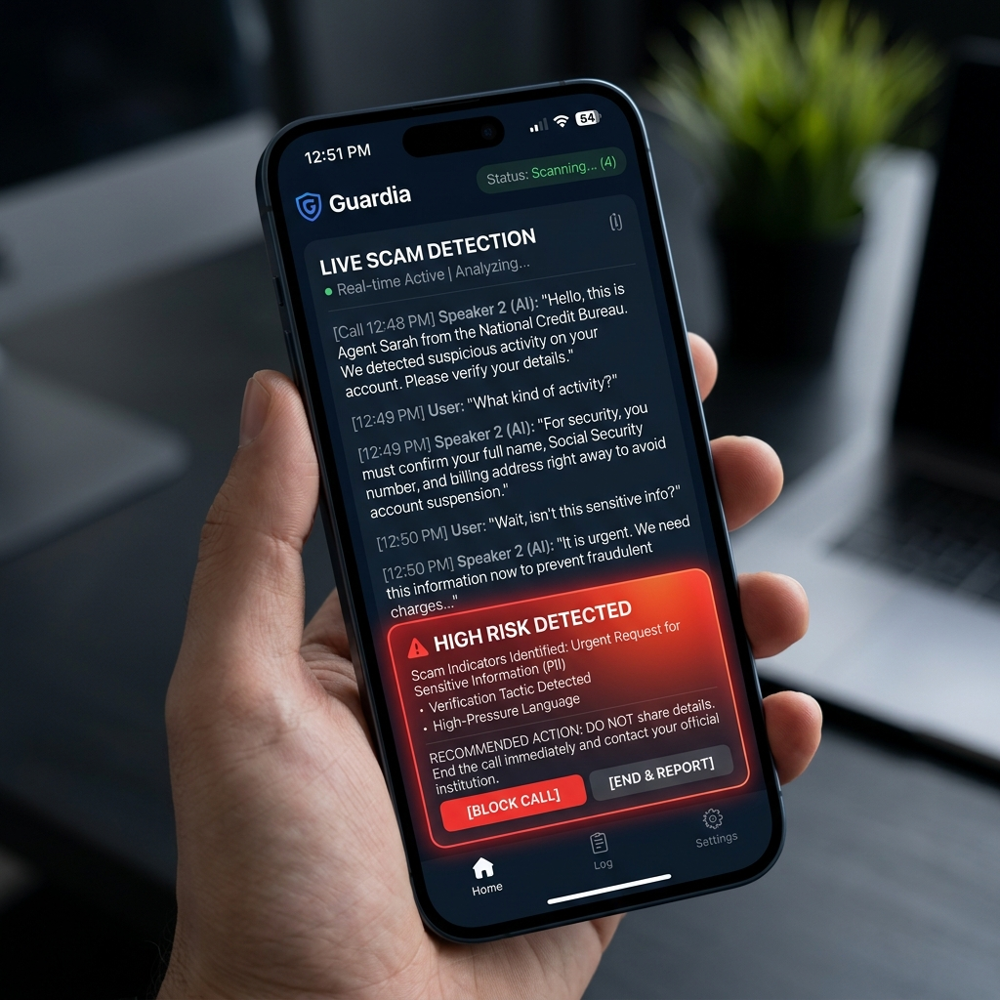

<div align="center">
  

  # 🛡️ GuardCall

  **Your Silent AI Co-Pilot for Real-Time Scam Protection**

  <p align="center">
    <a href="#features">Features</a> •
    <a href="#how-it-works">How It Works</a> •
    <a href="#security-architecture">Security Architecture</a> •
    <a href="#tech-stack">Tech Stack</a>
  </p>
</div>

---

## 🎯 The Problem
In the first 9 months of 2024 alone, ₹1,776 Cr was lost to digital arrest scams in India. 
Every existing solution (Truecaller, 1930 Helpline) intervenes *after* the money is gone or only provides a generic spam label before the call. **GuardCall fills the gap.** It is the first solution that sits with you **during** the call, coaching you in real time against sophisticated psychological manipulation.

## ✨ Features
- **Real-Time AI Coaching**: Detects scam patterns (manufactured urgency, false authority) and provides exact scripts to counter scammers within 4-5 seconds.
- **Auto-Generated Police Reports**: Automatically generates a structured PDF incident report (ready for FIR submission) if the peak risk score exceeds the danger threshold.
- **Community DB**: Cross-references numbers against a crowdsourced, dynamically weighted scam database.
- **Silent Protection**: No alarms, no panic. Just quiet, text-based coaching cards that slide up smoothly on your screen.

<div align="center">
  
</div>

## 🔒 Security Architecture — Why Your Data Is Safe
GuardCall records phone calls. This comes with a massive responsibility. Every layer of our architecture is designed around one principle: **store as little as possible, for as short a time as possible.**

| Security Principle | Implementation | Result |
| :--- | :--- | :--- |
| **Zero Raw Audio Storage** | Audio streams via WebSocket directly to Deepgram STT. Our servers *never* touch or store the audio bytes. | A database breach exposes **no audio**. |
| **PII Scrubbing** | The Groq AI model redacts Aadhaar numbers, accounts, and names *before* any transcript is written to MongoDB. | No sensitive personal data is logged in our DB. |
| **Conditional Storage** | Transcripts are ONLY saved if the peak risk score > 40. | Safe calls (family, delivery) leave **zero trace**. |
| **Consent Architecture** | Mandatory acknowledged consent banner + session binding before recording starts. | Full compliance with Indian IT laws. |
| **Session Security** | Cryptographically random 128-bit UUIDs + JWT Auth + User Scoping. | Cross-user transcript access is mathematically impossible. |

## 🛠️ Tech Stack
This is a strictly typed MERN stack Progressive Web App (PWA) optimized for mobile-first interactions.
* **Frontend**: React + Vite + Tailwind CSS v3 + Zustand + `vite-plugin-pwa`
* **Backend**: Node.js + Express
* **Database**: MongoDB Atlas with Mongoose
* **Auth**: JWT (jsonwebtoken + bcryptjs)
* **Audio Engine**: Web Audio API (`MediaRecorder`)
* **Real-time STT**: Deepgram Nova-2 WebSocket Streaming (Hindi-English Support)
* **AI Engine**: Groq API (`llama-3.3-70b-versatile` via LPU hardware for sub-500ms latency)
* **Sockets**: Socket.IO

## 🚀 Getting Started

### Prerequisites
- Node.js v18+
- API Keys: Deepgram, Groq, MongoDB URI

### Backend Setup
```bash
cd server
npm install
# Rename .env.example to .env and insert your API keys
npm run dev
```

### Frontend Setup
```bash
cd client
npm install
npm run dev
```

> **Note on Audio Constraints**: The frontend uses `getUserMedia` with `echoCancellation: false` and `noiseSuppression: false`. This is critical. Leaving these filters enabled causes the browser to filter out the scammer's voice coming from the speakerphone.

---
<div align="center">
  <i>Built for the ET AI Hackathon 2026 | Problem Statement #6 | Public Safety</i>
</div>
